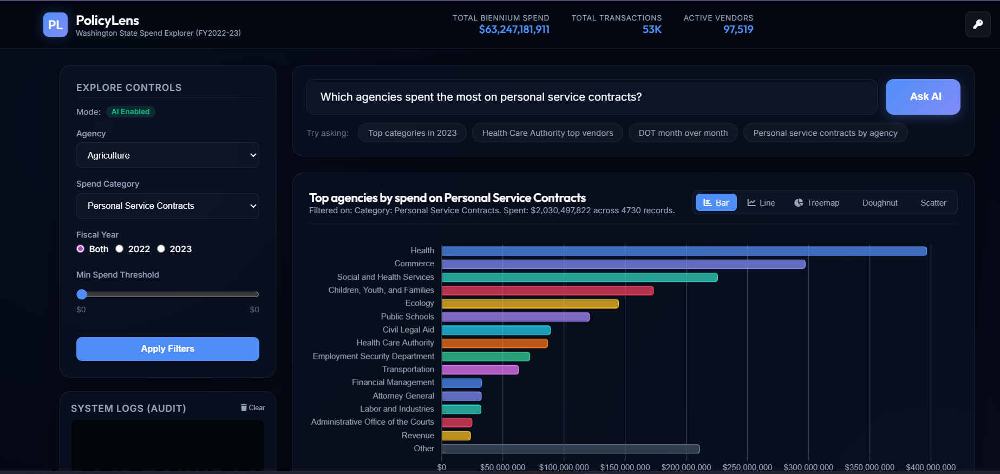

# PolicyLens — AI-Powered Vendor Spend Explorer

PolicyLens is a premium, client-side web application designed to help non-technical policy analysts explore and extract insights from Washington State Vendor Payments data (FY2022 and FY2023) without writing any queries, SQL, or python code.

---

## 1. The Problem & Chosen Direction

### The User Pain
A policy analyst staring at 935,000 rows of raw state vendor payment data across a biennium cannot answer a basic question like *"Which agencies grew their spending on personal service contracts the most?"* without writing SQL queries, setting up databases, or wrestling with fragile Excel pivot tables that crash on 50MB sheets. The data exists, but the insights are locked behind technical barriers.

### Why This Direction?
We chose a **zero-backend, client-side pre-aggregated static SPA (Single Page Application)** architecture powered by an LLM intent-extraction gate and a local JS query engine. 
Alternative paths we considered:
1. **SQL Database + LLM Text-to-SQL backend**: Set up a PostgreSQL/SQLite database and use LLM to write and execute SQL queries. We rejected this because of cost, latency, database hosting complexity, and the security risk of SQL injection or hallucinated destructive queries.
2. **Standard dashboard with static filters only**: Build a manual dashboard with no LLM. We rejected this because a static dashboard is rigid; it cannot answer specific, unstructured natural language questions that policy analysts naturally ask (e.g. *"Show me the top vendors for personal service contracts"*).

Our hybrid solution provides a **dual-mode system**:
- **AI Mode**: Translates plain English questions to structured JSON filters using the Gemini API, queries local pre-aggregated datasets instantly, and generates a clean 2-sentence insights summary.
- **Manual Mode**: Gracefully falls back to manual dropdowns, range sliders, and interactive chart drill-downs if no API key is provided, ensuring the tool is never a dead end.

---

## 2. Tech & Architectural Choices

### What Was Built & How It Works
*   **Preprocessing Pipeline (`build_data.py`)**: A Python utility that streams the raw Excel file using `openpyxl`, cleans fields, groups transaction data, and exports pre-compiled JSONs directly to the frontend data directory:
    *   `meta.json` (4.88 KB): Unique listings of agencies, categories, subcategories, and years.
    *   `summary.json` (6.53 MB): High-level aggregates grouped by agency, category, subcategory, year, and month.
    *   `vendors.json` (23.36 MB): Deep vendor-level details loaded lazily in the browser only when vendor-specific questions are asked.
*   **Frontend SPA Shell (`app/`)**: Written in Vanilla HTML5, CSS3, and ES6+ JavaScript. No build tools or node server needed.
    *   `queryEngine.js`: A bespoke client-side engine that handles range filters, multi-select values, sorting, limiting, and dimension aggregations in milliseconds in the browser.
    *   `aiLayer.js`: Interfaces directly with the Gemini API (`gemini-2.5-flash-lite`) to convert natural language queries into structured JSON query filters, generate insights, or supply alternative query suggestions.
    *   `charts.js`: Orchestrates interactive, responsive visual widgets using Chart.js (Horizontal Bar, Line/Area, Doughnut, Scatter) and D3.js (Treemaps).
    *   `logger.js`: A structured auditing logger that tracks system initialization, query durations, latency, and interaction events.

### Explicitly Deferred
*   **Persistent Database Backend**: All aggregations are done client-side, avoiding database hosting costs and server maintenance.
*   **Server-side API Proxy**: Direct browser-to-Gemini requests using the user's local API key (saved securely in `localStorage`), saving us from hosting a middleware API server.
*   **Persistent Analytics Sink**: Logs are directed to the console and a UI log terminal for local audit; external monitoring sinks (PostHog/Supabase) are stubbed out.

### What to Change in a Production Version
1.  **Backend Database (PostgreSQL/Supabase)**: Instead of loading a 23MB `vendors.json` file into the client's browser memory, host the data in a SQL database and query it via a paginated REST API.
2.  **Server Middleware for LLM Calls**: Proxy Gemini requests through a backend server to hide system prompts, manage API keys securely without prompting the user, and implement rate limiting/caching.
3.  **Real-Time Data Ingestion**: Replace the Python script with an ETL pipeline pulling directly from the Washington State Open Data Portal API.
4.  **Persistent Telemetry**: Wire `logger.js` to an analytics platform like PostHog or Datadog to track query latency, error rates, and model performance.

---

## 3. AI Usage Log

During the development of PolicyLens, we engaged in three key AI interactions to design, refine, and secure the application:

### Interaction 1: Blueprint and Project Plan Generation
*   **What was asked**: Propose a project plan to build a proof-of-concept web application helping a non-technical policy analyst get value out of Washington State's ~935,000 rows of Excel vendor payments.
*   **What it gave**: Detailed implementation plan proposing a pre-aggregated client-side database design (JSON files) with a natural language search query engine powered by Gemini intent extraction.
*   **What was kept/changed/rejected**: Kept the client-side pre-aggregation architecture. Changed the scope to add (a) an API key gateway prompting on first launch, (b) manual filter panel fallback if no key is entered, and (c) specific chart visualizations (Treemap, Bar, Line).

### Interaction 2: Model Upgrades and Error Resolution
*   **What was asked**: Debugged a 404 API error where `gemini-1.5-flash` was reported as unsupported or not found for the `v1beta` API version, and requested switching the app to use `gemini-2.5-flash-lite`.
*   **What it gave**: Recommended using the API key models endpoint to check key capability. Provided code changes in `aiLayer.js` and `app.js` to target the `gemini-2.5-flash-lite` model.
*   **What was kept/changed/rejected**: Kept all endpoint changes; this immediately resolved the 404 errors and enabled successful live natural language intent parsing.

### Interaction 3: Implementing Strict Guardrails & Anti-Hallucination Boundaries
*   **What was asked**: Fix the intent parser and visualization flows to prevent the AI from hallucinating or answering queries outside of Washington State vendor spend data (e.g. general knowledge, other years, other states like California).
*   **What it gave**: Added `out_of_scope` query logic across three files:
    *   `aiLayer.js`: Prompted the LLM to output `out_of_scope: true` and nullify other filters if queries go out of bounds.
    *   `queryEngine.js`: Halts execution early and yields an out-of-scope status.
    *   `app.js`: Intercepts the out-of-scope status, clears charts, and displays a warning card with three valid query suggestions.
    *   Simulated testing intents for local mock execution.
*   **What was kept/changed/rejected**: Kept the entire guardrail pipeline. This ensures the application remains grounded strictly in Washington State's local data and guides users back to valid queries.
